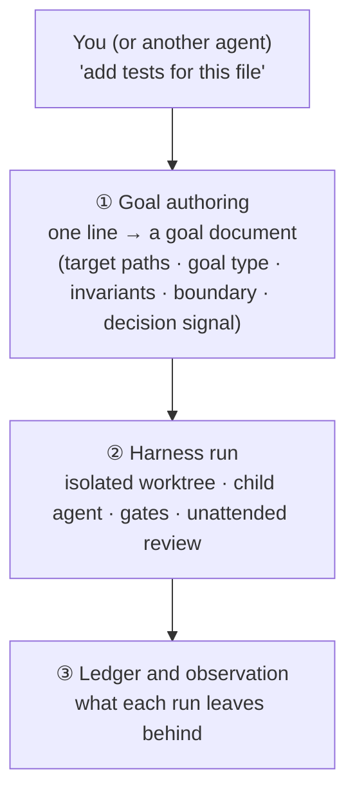
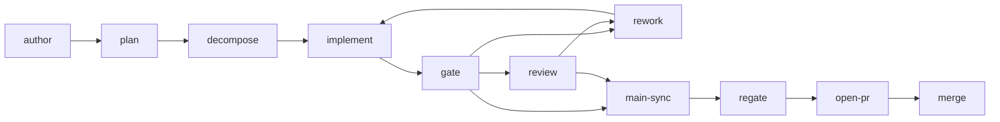

# How monad works

**In one sentence:** monad is a self-healing coding harness where one line of text sets eyes, hands and memory working together — agents developing agents.

This page is a map, not a spec. Wherever a number would go stale, it gives you the command that measures it instead.

## 1. From one sentence to a merged change



- **Entrances.** From a terminal, `monad harness say "<one line>"`. If you have already written a goal document, `monad harness ask 내부 문서 `<file>``. Inside the terminal UI, `/harness`. To list every entrance and its state, `monad self entrances`.
- **Goal authoring.** Your sentence becomes a goal *document*: which paths are in scope, what kind of goal it is, what must not change, where the boundary is, and a decision signal (condition / observation / expectation) that says when it is done.
- **Harness run.** The work happens in a separate git worktree, so your own working tree is not touched. A child agent implements, gates run the tests for the files it changed, a review checks the change, and failures loop back for rework.
- **Ledger and observation.** Each run leaves an execution record in its goal document, a worktree and branch, a run ledger entry, and structured logs. Look at them with `monad logs --category <c>` and `monad self run-ledger`.

### Eyes, hands and memory

| | What it is | Commands / tools |
|---|---|---|
| Eyes | Read another program's screen without taking ownership | `monad pty snapshot <ref>` (add `--ansi` for colors and attributes) · web crawl and browser tools |
| Hands | A tool loop (read, search, edit, write, shell) · typing into a live TUI or child process from outside | `monad pty text <ref> "<text>"` · `monad pty key <ref> <key>` |
| Memory | Memories injected every turn (user, feedback, project, reference) · the history of what monad changed in itself | `monad memory` · `monad self recall <query>` |

The point is that the three run **together**. Most agents are good at one of them. (Honest caveat: how often the three interlock within a single request has not been measured; the claim is true at the component level.)

## 2. The run graph: declared shape, code-driven execution

The shape of a harness run is **declared in YAML**, in the `graphs/` directory. Each goal type (implement, research, document, operate) picks a template, and every goal type has one. For implementation, the shape is roughly:



Branches (gate → rework / review / main-sync / open-pr) and loops (rework → implement) are part of the declaration, and each node declares its inputs, tools and outputs.

**What the declaration does not do yet:** it does not *drive* execution. The orchestrator (TypeScript) still controls the run; the YAML declares the shape, and observed steps are compared against it and any divergence is reported (a "shadow" check). Handing execution authority to the declaration is a risky change and is intentionally staged.

Not every declared graph is walked in practice. To see which ones actually run:

```bash
monad logs --event pipeline-node-entry --limit 40 --all --include-test --json --json-data
```

## 3. The three axes: intake, workflow, task manager

"Say it and it happens" rests on three parts that take a sentence, break it up and carry it through:

| Axis | Where | What it does |
|---|---|---|
| Intake | `src/intent-gate/` | sentence → triage → domain → automatic phase decomposition → mission |
| Mission arcs and phases | `src/autopilot/` | classify, budget, drift, preflight, revise and verify a mission's phases |
| Workflow | `src/workflow-runtime/` | YAML DAG engine (`monad wf`) |
| Tasks | `src/task-orchestrator/` | task store, runtimes, surfaces, task-to-workflow conversion |

**Intake has three live entrances** — Telegram, the terminal UI, and an internal API path used by system repair. Other channels (PWA, voice, CLI) are declared but have no producer yet. In particular, `monad harness say` from a terminal goes straight to the harness and **does not pass through intake** (no triage, domain or phase decomposition).

**How connected are they?** The mission machinery and the task store are tightly coupled. The workflow engine is not isolated, just the most thinly attached: the harness core does not use it directly, and intake does not reach it. Today the harness uses one workflow for one judgment (the rework-budget decision). "Making workflows first-class" means joining those two missing links, not building something new.

## 4. Self-healing: the harness triages and cleans up after itself

| Step | What happens |
|---|---|
| Classify | When a run stops, it is labelled with a reason: artifact deficit, budget exhausted, contract conflict, credential failure, already satisfied, completed without changes, and so on. Environment causes are ranked above run-stage evidence, so "the environment broke" is not blamed on the child. |
| Triage | Goals are sorted by domain and urgency. |
| Judge | Rework budget is decided by a workflow classify node; a shadow classifier compares without acting. |
| Clean up | `monad harness clean` reclaims worktrees and branches, choosing candidates by lifecycle stage and ownership, not by name. |
| Repair signals | `monad self repair-signals` · `monad self parked` |

The vocabulary is rich; how often the triage is *right* has not been measured yet.

## 5. Four universes

When monad starts a child, parent and child may live in different "universes": **prod**, **prod → isolated**, **test**, **test → isolated**. The universe is resolved once and passed down to the child. The **working directory is a separate axis**: isolating the universe alone would still let a child write into your tree, which is why harness runs use their own worktrees.

```bash
monad where              # which universe am I in
monad harness worktrees  # which worktrees exist and who owns them
```

## 6. The eyes are borrowed

Much of monad's view of the world comes from outside services. `catalog/resources.yaml` lists each resource with a `free_fallback` field: what still works if you do not have it. Web crawl/search services and each LLM provider are listed; installed binaries and browsers (the crawl skill, browser automation, Chrome/CDP) are not listed yet, and many credentialed resources still have an empty `free_fallback`.

Only capabilities with a written free fallback should be treated as "core". Run `monad doctor` to see what is unlocked on your machine; see [configuration](configuration.md) and [providers](providers.md).

## 7. Surfaces: many entrances, one engine

| Surface | Entry | Notes |
|---|---|---|
| CLI | `monad <command>` | the full list is in [commands](commands.md) |
| NEXUS / PWA | `monad nexus` | daemon lifecycle plus a web dashboard |
| Terminal UI | `monad` | one surface among several, see [TUI](tui.md) |
| MCP | `monad mcp` | run monad as an MCP server |
| Chat channels | Telegram, Discord, … | see [Telegram](telegram.md) and [Discord](discord.md); maturity varies by channel |
| ACP | `monad acp` · `monad attach` | attach external agents |

## What this page deliberately does not claim

- That the missing links (harness ↔ workflow, intake ↔ workflow) exist. They do not yet.
- How accurate the self-healing triage is. The labels are counted; correctness is not.
- How many times eyes, hands and memory interlock per request. Not measured.
- How complete each chat channel is. File counts are not behavior.
- Fixed counts of anything. Use the commands above to measure them when you need them.
