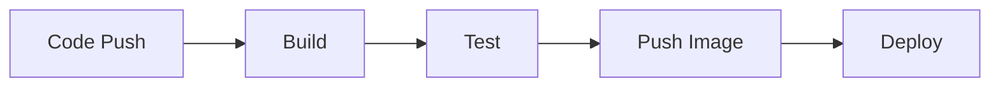

# {PROJECT_NAME} — CI/CD & Infrastructure

> Auto-generated by project-onboarding skill | {DATE}

---

## 1. Infrastructure Overview

```mermaid
{Mermaid flowchart — 배포 파이프라인 다이어그램}
```

### Deployment Target

| Property | Value |
|---|---|
| Provider | {GCP / AWS / Azure / Vercel / etc.} |
| Service | {Cloud Run / ECS / Lambda / etc.} |
| Region | {region} |
| Container | {Docker / buildpack / etc.} |
| Domain | {production URL} |

---

## 2. Build Configuration

### Container (Docker)

| Property | Value |
|---|---|
| Base Image | {e.g., python:3.10-slim} |
| Build Context | {Dockerfile 위치} |
| Exposed Port | {port} |
| Entry Point | {CMD/ENTRYPOINT} |

### Build Steps
1. {step 1}
2. {step 2}
3. ...

---

## 3. CI/CD Pipeline

### Trigger
- {e.g., GitHub main branch push → auto-deploy}
- {e.g., PR merge → staging deploy}

### Pipeline Steps



### Pipeline Configuration File
- **File:** {e.g., cloudbuild.yaml, .github/workflows/deploy.yml}
- **Build Machine:** {e.g., E2_HIGHCPU_8}
- **Timeout:** {e.g., 900s}
- **Artifacts:** {e.g., Docker image → Artifact Registry}

---

## 4. Environment & Secrets

### Secret Management
- **Method:** {GCP Secret Manager / AWS Secrets Manager / env vars / etc.}
- **Priority:** {e.g., env vars → Secret Manager → config file}

### Required Secrets

| Secret Name | Purpose | Source |
|---|---|---|
| {secret_name} | {용도} | {저장소} |

### Environment Variables

| Variable | Purpose | Required |
|---|---|---|
| {VAR_NAME} | {용도} | Yes/No |

---

## 5. Deployment Commands

### Local Development
```bash
{로컬 실행 명령어}
```

### Docker (Local)
```bash
{Docker 로컬 실행 명령어}
```

### Production Deploy
```bash
{프로덕션 배포 명령어}
```

---

## 6. Monitoring & Health

| Property | Value |
|---|---|
| Health Check | {endpoint or method} |
| Logging | {Cloud Logging / CloudWatch / etc.} |
| Scaling | {auto-scale settings} |
| Resource Limits | {CPU, Memory} |

---

## 7. Architecture Diagram

```mermaid
{Mermaid flowchart — 인프라 아키텍처}
```
