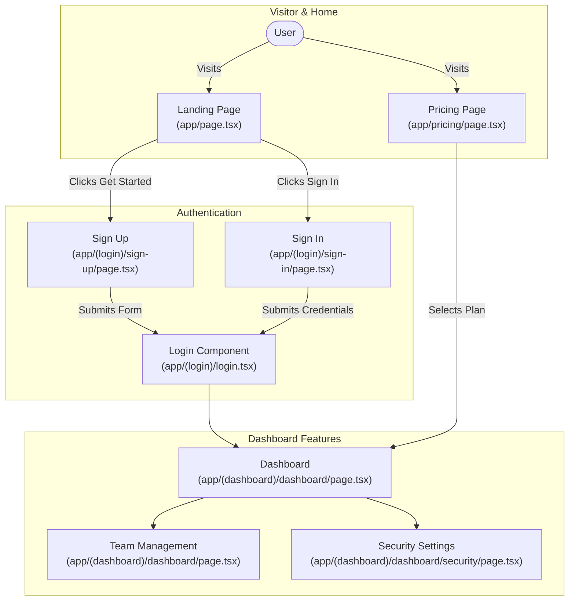

# Project Onboarding

프로젝트 디렉토리 → 자동 분석 → 3단계 온보딩 문서 + 다이어그램 생성.

## Flow

```
Target Project Directory
      |
  Step 1-2: Scan & Analyze
      |
  ┌──────────────────────────────────────────────────────────────┐
  │  EXPRESS (항상 먼저 실행)                                       │
  │  → 프로젝트 개요 + 기술 스택 + 핵심 기능 + 간소화 플로우차트      │
  │  → 단일 마크다운 (~2-3분)                                      │
  └──────────────────────────────────────────────────────────────┘
      |
  모드에 따라 추가 진행:
      |
      +-- express만 요청 → 여기서 끝
      |
      +-- fluent 요청 → Express 출력 후 Fluent 추가 생성
      |     → PRD + IA + UseCases + Business Summary
      |     → UX Flow Chart (파일경로 매핑)
      |     → CI/CD 문서 (인프라 감지 시)
      |     → Mermaid 다이어그램들 (~8-10분 추가)
      |
      +-- advanced 요청 → Express + Fluent 후 Advanced 추가
      |     → Excalidraw 아키텍처 + UX Flow → PNG 렌더링
      |     → 또는 Fluent 완료 후 "Advanced 다이어그램도 생성할까요?" 질문
      |
      +-- web 요청 → Express + Fluent 후 Web Deploy 추가
      |     → content-to-web PROJECT 모드로 HTML 대시보드 생성
      |     → Mermaid.js CDN 라이브 렌더링
      |     → Vercel 배포 (선택)
      |     → 또는 Fluent 완료 후 "웹 리포트도 생성할까요?" 질문
      |
      +-- ambiguous → Express 출력 후 "Fluent/Advanced/Web으로 진행할까요?" 질문
```

## Auto-Routing Rules

**CRITICAL: Express는 항상 먼저 실행한다.** Fluent/Advanced/Web 모드라도 Express 결과물을 먼저 보여준 후 추가 생성.

**-> EXPRESS ONLY** when user says:
- "express", "빠르게", "quick", "overview", "간단", "요약"

**-> EXPRESS + FLUENT** when user says:
- "fluent", "심층", "detailed", "full", "상세", "PRD"
- "IA", "use case", "CI/CD"

**-> EXPRESS + FLUENT + ADVANCED** when user says:
- "advanced", "전체", "complete", "excalidraw", "렌더링", "이미지 포함"

**-> EXPRESS + FLUENT + WEB** when user says:
- "web", "웹배포", "웹 리포트", "deploy", "website", "홈페이지"
- "웹으로", "HTML", "대시보드"

**-> EXPRESS + ASK** when ambiguous:
- Express 먼저 출력 → "Fluent(PRD/IA/UseCase), Advanced(+Excalidraw), 또는 Web(+HTML 대시보드 배포)으로 진행할까요?"

---

## Analysis Pipeline

### Phase 1: Project Scan (Express 준비)

Read `references/analysis-checklist.md` first, then:

1. **Detect project type** from manifest files
2. **Read README.md** — purpose, features, setup
3. **Read entry point** — via checklist heuristics
4. **Read config files** — .env.example, docker-compose.yml, Dockerfile, CI/CD
5. **Glob directory structure** — top 2 levels
6. **Read existing docs** — docs/, CLAUDE.md
7. **Detect output language** — README 언어 따름
8. **Detect frontend framework** — React, Next.js, Flutter, Streamlit, Vue, Angular 등
9. **Detect deployment infra** — Docker, k8s, GCP, AWS, GitHub Actions, GitOps 등

### Phase 2: Dependency Analysis

1. **Parse dependency files** completely
2. **Categorize by purpose** (UI, API, DB, Auth, AI, Testing, Deploy, External APIs)
3. **Identify tech stack summary**

### Phase 3: Code Structure Mapping

1. **Glob all source files** — exclude patterns
2. **Trace imports** from entry point (3 levels)
3. **Identify architectural layers** (Routes, Components, Services, Data, Config, Auth)
4. **Map user-facing flows** — step-by-step user journey
5. **Build file-path-to-feature mapping** — 모든 주요 파일에 기능 할당

---

## Express Mode Output

**항상 먼저 생성.** `{project}/내부 문서 `express``

```markdown
# {Project Name} — Project Onboarding

## 1. Project Overview
(목적, 타겟 사용자, 핵심 가치 — 2-3문장)

## 2. Tech Stack
| Category | Technology | Version | Purpose |
|----------|-----------|---------|---------|
| Language | ... | ... | ... |
| Framework | ... | ... | ... |
| Database | ... | ... | ... |
| AI/ML | ... | ... | ... |
| Auth | ... | ... | ... |
| Deploy | ... | ... | ... |

## 3. Key Features
- **Feature 1**: description
- **Feature 2**: description

## 4. Project Structure
(주요 디렉토리 트리 + 역할 설명)

## 5. App Flow (High-Level)
```mermaid
flowchart TD
    %% 간소화 — 파일경로 없음, 15-20 노드 이내
```

## 6. Getting Started
- Prerequisites
- Installation
- Run locally
- Key environment variables
```

---

## Fluent Mode Output (Express 이후 추가)

`{project}/docs/onboarding/` 디렉토리에 생성:

### 개발자용 문서
1. **PRD.md** — from `references/prd-template.md`
2. **IA.md** — from `references/ia-template.md`
3. **UseCases.md** — from `references/usecase-template.md`
4. **CICD.md** — from `references/cicd-template.md` (인프라 감지 시에만)

### 비개발자/의사결정자용 문서
5. **BusinessSummary.md** — 비즈니스 친화적 요약
   - 비기술적 언어로 작성
   - 프로젝트 가치, 핵심 기능, 사용자 여정을 비개발자가 이해하도록
   - Mermaid 다이어그램은 간소화 버전만 포함
   - 비용/인프라 개요, 보안 수준, 확장성을 경영진 관점으로

### 다이어그램 (Mermaid)
6. **diagrams/ux-flow.mmd** — UX 플로우차트 (파일경로 매핑 포함) ← 핵심
7. **diagrams/app-flow-simple.mmd** — 간소화 플로우
8. **diagrams/component-map.mmd** — 모듈 의존성 맵
9. **diagrams/data-flow.mmd** — 데이터 흐름도 (해당 시)

### 인덱스
10. **README.md** — 모든 문서 링크 + Express 내용 포함

---

## UX Flow Chart 생성 규칙 (핵심)

**MUST read `~/.claude/skills/diagram-master/references/engines/mermaid/syntax-reference.md` before generating.**

프론트엔드가 있는 프로젝트(React, Next.js, Flutter, Streamlit, Vue, Angular 등)에서는 반드시 **파일경로 매핑된 UX 플로우차트**를 생성한다.

### Node Format (2줄 구조)
```
노드ID["Feature Name\n(relative/path/to/file.ext)"]
```

### Edge Label Format
Edge에는 **사용자 행동**을 라벨로 표시:
```
A -->|"Clicks Sign In"| B
A -->|"Submits Form"| C
A -->|"Visits"| D
```

### Subgraph로 UX 영역 그룹핑


### Styling
```
classDef page fill:#1f2937,stroke:#4b5563,color:#f9fafb
classDef auth fill:#7c2d12,stroke:#c2410c,color:#fed7aa
classDef feature fill:#1e3a5f,stroke:#3b82f6,color:#dbeafe
classDef action fill:#064e3b,stroke:#059669,color:#d1fae5
classDef user fill:#fef3c7,stroke:#d97706,color:#92400e
```

### 프레임워크별 파일경로 탐지
| Framework | Route Detection Pattern |
|---|---|
| Next.js (App Router) | `app/**/page.tsx`, `app/**/layout.tsx` |
| Next.js (Pages) | `pages/**/*.tsx` |
| React (React Router) | `src/pages/`, `src/routes/`, Router config |
| Flutter | `lib/screens/`, `lib/pages/`, router config |
| Streamlit | `app.py` sidebar radio/selectbox, slide classes |
| Vue | `src/views/`, `src/pages/`, router config |
| Angular | `src/app/**/*.component.ts`, routing modules |

### 파일경로 매핑 규칙
1. **실제 파일만** — glob으로 존재 확인된 파일경로만 사용
2. **상대 경로** — 프로젝트 루트 기준
3. **괄호 감싸기** — `(path/to/file.ext)` 형태로 파일경로 표시
4. **라우트 그룹** — Next.js `(group)` 등 프레임워크 라우트 규칙 반영

---

## CI/CD 문서 생성 조건

다음 중 하나라도 감지되면 `CICD.md`를 생성:
- `Dockerfile`, `docker-compose.yml`
- `cloudbuild.yaml`, `.github/workflows/`, `.gitlab-ci.yml`
- `Jenkinsfile`, `Makefile` (deploy targets)
- `k8s/`, `kubernetes/`, `helm/`, `terraform/`
- `vercel.json`, `netlify.toml`, `fly.toml`
- `serverless.yml`, `amplify.yml`
- ArgoCD, FluxCD 관련 설정

`references/cicd-template.md` 참조.

---

## Advanced Mode (Fluent 이후 추가)

Excalidraw 다이어그램 생성 + PNG 렌더링.

### 생성 다이어그램
1. **architecture.excalidraw → architecture.png** — Fan-Out 아키텍처
2. **ux-flow.excalidraw → ux-flow.png** — Assembly-Line UX 플로우

### Excalidraw 규칙
- Read `~/.claude/skills/diagram-master/references/engines/excalidraw/color-palette.md`
- Read `~/.claude/skills/diagram-master/references/engines/excalidraw/element-templates.md`
- Build section-by-section for large diagrams
- 렌더: `cd ~/.claude/skills/diagram-master/references && uv run python engines/excalidraw/render_excalidraw.py <path>`
- 필수: 렌더 → 이미지 확인 → 결함 수정 → 재렌더

### Advanced 트리거
- 사용자가 처음부터 "advanced" 요청 → Express → Fluent → Advanced 순차 실행
- Fluent 완료 후 → "Excalidraw 렌더링 이미지도 생성할까요? (Advanced Mode)" 질문

---

## Web Mode (Fluent 이후 추가)

content-to-web 스킬의 **PROJECT 모드**를 활용하여 Fluent 결과물을 인터랙티브 HTML 대시보드로 변환.

### 연계 방법

Fluent 문서 생성 완료 후, content-to-web의 PROJECT 모드가 자동 실행:

1. `docs/onboarding/` 디렉토리의 모든 .md 파일과 `diagrams/*.mmd` 읽기
2. `~/.claude/skills/content-to-web/references/project-report-template.html` 참조
3. Mermaid 코드 블록을 `<pre class="mermaid">` 태그로 변환 (Mermaid.js CDN 라이브 렌더링)
4. `docs/onboarding/index.html` 생성
5. (선택) Vercel 배포

### HTML 대시보드 구성

| 온보딩 문서 | 대시보드 섹션 |
|---|---|
| `express.md` | Hero, Tech Stack, App Flow, Project Structure, Quick Start |
| `BusinessSummary.md` | Business Summary, User Journey, Cost, Security |
| `PRD.md` | Product Requirements (우선순위 카드 + 요구사항 테이블) |
| `IA.md` | Navigation (IA), Data Flow, Module Dependencies |
| `UseCases.md` | Use Cases (카드 그리드 + Mermaid overview) |
| `CICD.md` | CI/CD Pipeline, Infrastructure, Secrets & Env |
| `diagrams/ux-flow.mmd` | Full UX Flow 섹션 |
| `diagrams/app-flow-simple.mmd` | App Flow 다이어그램 |
| `diagrams/component-map.mmd` | Module Dependencies 다이어그램 |

### Mermaid 렌더링 규칙

1. `<script src="https://cdn.jsdelivr.net/npm/mermaid@11/dist/mermaid.min.js"></script>` 헤드에 포함
2. `mermaid.initialize({ startOnLoad: true, theme: 'default', securityLevel: 'loose' })`
3. 각 다이어그램은 `.mermaid-wrap` > `pre.mermaid` 형태
4. `.mmd` 파일의 frontmatter (---...---) 제거 후 임베딩
5. 다이어그램마다 설명 `<h4>` 제목 추가

### 코드 블록 (프로젝트 구조)

- `white-space: pre` 필수 — 트리 구조 줄바꿈 보존
- 구문 컬러링: 폴더명 파란색, 파일명 노란색, 주석 회색

### Web 트리거

- 사용자가 처음부터 "web" 요청 → Express → Fluent → Web 순차 실행
- Fluent 완료 후 → "웹 리포트(HTML 대시보드)도 생성할까요? (Web Mode)" 질문
- 기존 `docs/onboarding/` 문서가 이미 있으면 Fluent 스킵 → 바로 Web 생성 가능

---

## BusinessSummary.md 생성 규칙

비개발자/의사결정자를 위한 문서. 기술 용어 최소화.

```markdown
# {Project Name} — Business Overview

## What This Product Does
(한 문단, 비기술적 언어)

## Who It's For
- Primary users: ...
- Secondary users: ...

## Key Capabilities
1. **{기능명}** — {비즈니스 가치 관점 설명}
2. ...

## User Journey (Simplified)
```mermaid
{간소화 플로우차트 — 기술 세부사항 없음, 사용자 관점}
```

## Technology & Infrastructure
- Hosting: {어디에 배포되는지}
- Security: {인증 방식, 보안 수준 요약}
- Scalability: {동시 사용자, 확장 가능성}
- Cost factors: {주요 비용 요소}

## Current Status & Maturity
- Development stage: {MVP/Beta/Production}
- Team size: {추정}
- Last significant update: {git log 기반}
```

---

## Output Structure Summary

```
{project}/docs/onboarding/
├── express.md                     # [Express] 항상 생성
├── README.md                      # [Fluent] 인덱스
├── PRD.md                         # [Fluent] 개발자용 PRD
├── IA.md                          # [Fluent] 정보 아키텍처
├── UseCases.md                    # [Fluent] 유스케이스
├── BusinessSummary.md             # [Fluent] 비개발자용 비즈니스 요약
├── CICD.md                        # [Fluent] CI/CD (인프라 감지 시)
├── index.html                     # [Web] 인터랙티브 HTML 대시보드 ← content-to-web 연계
├── diagrams/
│   ├── ux-flow.mmd                # [Fluent] 파일경로 매핑 UX 플로우 ← 핵심
│   ├── app-flow-simple.mmd        # [Fluent] 간소화 플로우
│   ├── component-map.mmd          # [Fluent] 모듈 의존성
│   ├── data-flow.mmd              # [Fluent] 데이터 흐름 (선택)
│   ├── architecture.excalidraw    # [Advanced] 아키텍처
│   ├── architecture.png           # [Advanced] 렌더링
│   ├── ux-flow.excalidraw         # [Advanced] UX 플로우
│   └── ux-flow.png                # [Advanced] 렌더링
└── (기존 express.md 내용은 README.md에도 포함)
```

---

## Rules

1. **Express 항상 먼저** — 어떤 모드든 Express 결과물을 먼저 출력
2. **소스 코드 먼저 읽기** — 추측 금지
3. **.gitignore 존중**
4. **바이너리/생성 파일 스킵** — node_modules, .venv, __pycache__, dist, build, .next, .git
5. **언어 자동 감지** — README 언어 따라 출력
6. **상대 경로만** — 프로젝트 루트 기준
7. **기존 파일 덮어쓰기 전 확인**
8. **Mermaid syntax 정확성** — 반드시 syntax reference 참조
9. **마크다운 보존** — Mermaid 코드 블록은 ```mermaid 형태로 보존 (향후 프로젝트 개선용)
10. **대형 프로젝트 샘플링** — 200+ 파일 시 entry point → import 3레벨 → 나머지 구조만
11. **CI/CD 자동 감지** — 인프라 파일 발견 시 CICD.md 자동 생성
12. **비개발자 문서** — Fluent에서 BusinessSummary.md 항상 생성

## Parallel Execution Strategy

**Express:** 1-2 Explore agents → 단일 문서 생성
**Fluent:** Express 출력 → 3 Explore agents → 문서들 병렬 생성
**Advanced:** Fluent 출력 → Excalidraw 에이전트 병렬 → 렌더링 → 이미지 확인
**Web:** Fluent 출력 → content-to-web PROJECT 모드 → HTML 생성 → (선택) Vercel 배포
